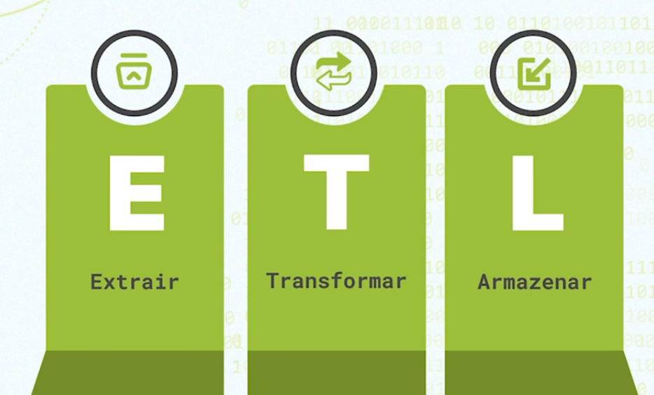

# Linguagens mais utilizadas

O projeto desenvolve uma pipeline de dados onde obtemos os dados das linguagens de programação utilizadas por algumas grandes empresas, como Amazon, Spotify, Netflix e Apple.
<div align="center">
  
  <br>
  <em>Figura 1: Projeto de ETL das linguagens mais utilizadas</em>
</div>

Para realizar esse projeto, é necessário criarmos um pipeline ETL para a extração, transformação e carga (em inglês, Extract, Transform e Load), conforme a figura a baixo. 

<div align="center">
  
  <br>
  <em>Figura 2: Processo de ETL</em>
</div>


## Tecnologias Utilizadas

Para implementar esse ETL foi necessário utilizar a linguagem **Python**, com as seguintes tecnologias:

- **Biblioteca Requests**: para extrair dados de diferentes APIs;
    ````
    pip install requests
    ````
- **GitHub API**: API da plataforma de gerenciamento de código fonte, que permite o acesso aos repositórios e informações de usuários.

O Github será utilizado como fonte dos dadados. Através da API, teremos acesso aos dados sobre as linguagens de programação utilizadas pelas empresas mencionadas em seus projetos, conforme a figura abaixo. Por fim, a biblioteca Requests facilita o envio e recebimento de informações pela internet.

<div align="center">
  
  <br>
  <em>Figura 3: Processo de requisição do servidor</em>
</div>


## Referências 
1. [Millena Gená Pereira](https://cursos.alura.com.br/user/millenagena)
2. [Python e APIs: conhecendo a biblioteca Requests](https://cursos.alura.com.br/course/python-apis-conhecendo-biblioteca-requests)
3. [Quickstart](https://requests.readthedocs.io/en/latest/user/quickstart/)
4. [git amazon](https://github.com/amzn)
5. [git spotify](https://github.com/spotify)
6. [git netflix](https://github.com/netflix)